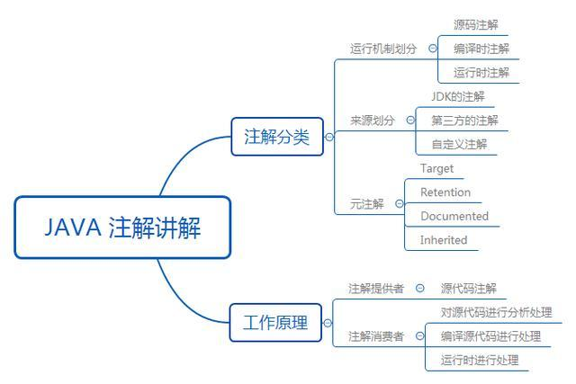

# 注解/注解解析器

* [Annotation](#anno)

  1. [注解](#anno_anno)

  2. [快速开始](#anno_qs)

  3. [元注解](#anno_meta)

     -> [@Target](#a_m_target)

     -> [@Retention](#a_m_retention)

     -> [@Documented](#a_m_documented)

     -> [@Inherited](#a_m_inherited)

* [注解解析][parse]

[parse]: processor


## <span id="anno">Annotation</span>

　　\> <span id="anno_anno">注解</span>(Annotation)，于JDK5.0引入的一种注释机制。

　　如果说注释是写给人看的，那么注解解释写给程序看的；它类似于标签，用于标识一个类、一个方法、一个属性等。为当前读取该注解的程序提供判断依据。

　　

　　\> <span id="anno_qs">快速开始</span>

　　定义一个简单的注解

```java
import java.lang.annotation.ElementType;
import java.lang.annotation.Retention;
import java.lang.annotation.RetentionPolicy;
import java.lang.annotation.Target;

@Target({ElementType.METHOD})
@Retention(RetentionPolicy.RUNTIME)
public @interface Anno {

	String value();

}
```

　　\> <span id="anno_meta">元注解</span>

　　jdk中提供了4个标准的用来对注解类型进行注解的注解类，我们称之为元注解：

```java
@Target
@Retention
@Documented
@Inherited
```

　　<span id="a_m_target">@Target </span>

　　注解表示注解用于什么地方，值在枚举类ElementType中定义。

```java
public enum ElementType {
    // 类、接口、枚举类
    /** Class, interface (including annotation type), or enum declaration */
    TYPE,

    // 成员变量
    /** Field declaration (includes enum constants) */
    FIELD,

    // 方法
    /** Method declaration */
    METHOD,

    // 方法参数
    /** Formal parameter declaration */
    PARAMETER,

    // 构造方法
    /** Constructor declaration */
    CONSTRUCTOR,

    // 局部变量
    /** Local variable declaration */
    LOCAL_VARIABLE,

    // 注解类
    /** Annotation type declaration */
    ANNOTATION_TYPE,

    // 包
    /** Package declaration */
    PACKAGE,

    // 类型参数
    /**
     * Type parameter declaration
     *
     * @since 1.8
     */
    TYPE_PARAMETER,

    // 使用类型的任何地方
    /**
     * Use of a type
     *
     * @since 1.8
     */
    TYPE_USE
```

　　<span id="a_m_retention">@Retention </span>

　　用于指定注解的生命周期，即被描述的注解在它所修饰的类中可以保存到什么时候，值在枚举类RetentionPolicy中定义

```java
public enum RetentionPolicy {
    // 源文件保留
    /**
     * Annotations are to be discarded by the compiler.
     */
    SOURCE,

    // 编译期保留，默认值
    /**
     * Annotations are to be recorded in the class file by the compiler
     * but need not be retained by the VM at run time.  This is the default
     * behavior.
     */
    CLASS,

    // 运行期保留，可以通过反射获取注解信息
    /**
     * Annotations are to be recorded in the class file by the compiler and
     * retained by the VM at run time, so they may be read reflectively.
     *
     * @see java.lang.reflect.AnnotatedElement
     */
    RUNTIME
}
```

　　<span id="a_m_documented">@Documented </span>

　　在定义注解时添加了该注解，在使用javadoc工具为类生成帮助文档时，定义的注解会被javadoc工具提取成文档

　　[@Documented注解测试](https://blog.csdn.net/pengjunlee/article/details/79683621)

　　<span id="a_m_inherited">@Inherited </span>

　　允许子类继承父类中的注解

　　[@Inherited注解测试](https://blog.csdn.net/pengjunlee/article/details/79683621)


## [注解解析][parse]